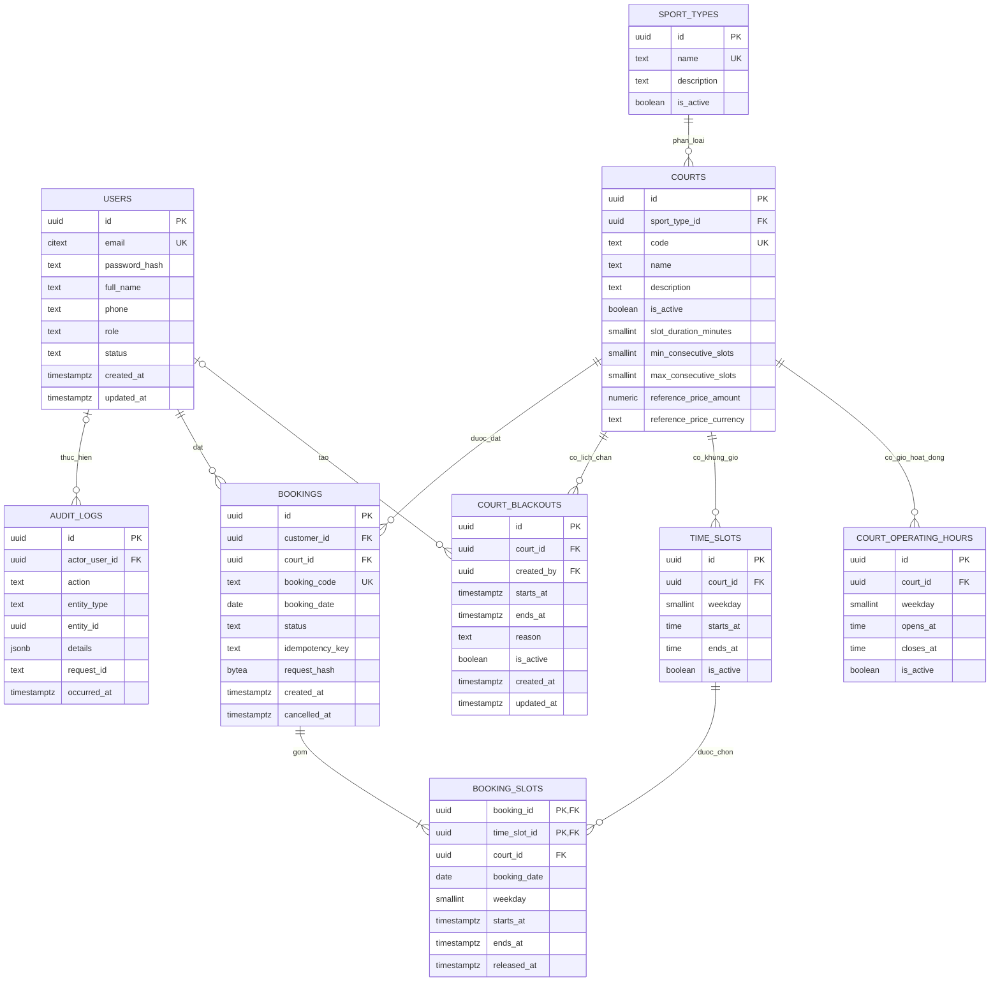

# ERD và lược đồ quan hệ — Hệ thống đặt sân thể thao

**Phiên bản:** 1.0

**Trạng thái:** Huy đã duyệt và chốt ERD ngày 06/10/2026; dùng làm chuẩn cho Goose migrations.

**Người duyệt:** Huy

**Phạm vi:** Thiết kế dữ liệu quan hệ PostgreSQL cho MVP.

Tài liệu này là bản ERD và lược đồ quan hệ đã chốt theo SRS của MVP. Mô hình giữ `time_slots` là mẫu khung giờ lặp hằng tuần và `booking_slots` là các khung giờ được đặt theo ngày cụ thể. Cấu hình theo sân, chống tạo trùng khi gửi lại yêu cầu, lịch sử đặt sân và dữ liệu kiểm toán được thể hiện rõ. PostgreSQL ngăn các lượt đặt còn hiệu lực chồng lấn thời gian, kể cả khi lịch đã đổi và lượt đặt cũ vẫn tham chiếu mẫu khung giờ trước đó.

## Nguồn tham chiếu

- SRS-SB-001 v2.0, đặc biệt FR-07–FR-19, BR-01–BR-18 và NFR-04–NFR-06: [SRS](https://docs.google.com/document/d/1pRTJGfRwTsopUzYMMqSoESE6M_wwXj0VbnROKVcUSbE/edit).
- Quyết định kiến trúc: Modular Monolith, Go/Gin, GORM, PostgreSQL, REST `/api/v1` và vai trò USER/ADMIN: [thẻ kiến trúc](https://trello.com/c/0VhI2oe1).
- Sơ đồ và mô tả ban đầu: [Sport Booking ERD](https://docs.google.com/document/d/1eav-w6EkxyS2JL8dKc_e71RVx3YNJYFO/edit).
- Task thiết kế: `[DES] Chốt ERD & Relational Schema` (Huy phụ trách). File này là chuẩn để đối chiếu khi review migration.

## Sơ đồ thực thể và quan hệ



`time_slots` là các mẫu khung giờ lặp hằng tuần của một sân. `booking_slots` ghi lại mẫu đã chọn, `booking_date` theo ngày địa phương và thời điểm bắt đầu/kết thúc thực tế. Lượt đặt bị hủy vẫn nằm trong lịch sử; các dòng slot tương ứng được gán `released_at` để khoảng giờ có thể được đặt lại. Dữ liệu thời gian lưu tại lúc đặt giúp giữ đúng lịch sử khi mẫu lịch hằng tuần thay đổi.

## Thiết kế lược đồ quan hệ

| Bảng | Khóa và trường quan trọng | Ràng buộc và mục đích |
| --- | --- | --- |
| `users` | PK `id`; `email` (`citext`), `password_hash`, `full_name`, `phone`, `role`, `status`, các mốc thời gian | Email duy nhất và không phân biệt chữ hoa/thường (`citext` cần extension tương ứng của PostgreSQL; có thể thay bằng unique index trên `lower(email)`). `role` nhận `USER` hoặc `ADMIN` theo SRS và kiến trúc. Không lưu mật khẩu dạng rõ. |
| `sport_types` | PK `id`; `name` duy nhất; `description`, `is_active` | Giữ các dòng đã được sân tham chiếu; ngừng kích hoạt thay vì xóa. |
| `courts` | PK `id`; FK `sport_type_id`; `code` duy nhất; `name`, `description`, `is_active`; `slot_duration_minutes`, `min_consecutive_slots`, `max_consecutive_slots`; có thể rỗng `reference_price_amount`, `reference_price_currency` | Mỗi sân thuộc một loại thể thao. Theo FR-07, cấu hình slot đặt ở từng sân; mặc định 60 phút và từ 1 đến 4 slot liên tiếp. Yêu cầu thời lượng dương và `1 <= min_consecutive_slots <= max_consecutive_slots`. Giá tham khảo chỉ để hiển thị, không âm; nếu có giá thì phải có mã tiền tệ ISO 4217 và ngược lại. Ngừng kích hoạt sân thay vì xóa dữ liệu lịch sử. |
| `court_operating_hours` | PK `id`; FK `court_id`; `weekday`, `opens_at`, `closes_at`, `is_active` | Mỗi sân có thể có nhiều khoảng giờ hoạt động không chồng lấn trong cùng thứ theo ISO (1=thứ Hai…7=Chủ nhật). Yêu cầu `opens_at < closes_at`. Bảng này mô tả giờ mở cửa hằng tuần, không ghi đè chính sách slot của sân. Ngừng kích hoạt khoảng giờ cũ để giữ lịch sử. Giờ hoạt động qua nửa đêm nằm ngoài mô hình MVP này. |
| `time_slots` | PK `id`; FK `court_id`; `weekday`, `starts_at`, `ends_at`, `is_active` | Mẫu slot lặp hằng tuần được tạo từ giờ hoạt động và thời lượng slot của sân. Yêu cầu `starts_at < ends_at`, các mẫu đang hoạt động không chồng lấn trong cùng sân/thứ, và `UNIQUE (id, court_id, weekday)` để làm đích cho FK ghép của `booking_slots`. Chỉ mẫu đang hoạt động mới được chọn cho lượt đặt mới; ngừng kích hoạt mẫu cũ nhưng giữ các mẫu đã được lịch sử tham chiếu. |
| `court_blackouts` | PK `id`; FK `court_id`; FK `created_by` có thể rỗng; `starts_at`, `ends_at`, `reason`, `is_active`, các mốc thời gian | Yêu cầu `starts_at < ends_at`. Chỉ lịch chặn đang hoạt động mới ngăn lượt đặt mới có khoảng giờ thực tế giao nhau. Tắt lịch chặn thì các yêu cầu sau đó không còn bị chặn; tạo/sửa lịch chặn không tự hủy lượt đặt đã xác nhận. |
| `bookings` | PK `id`; FK `customer_id`, FK `court_id`; `booking_code` duy nhất; `booking_date`, `status`, `idempotency_key` bắt buộc, `request_hash`, `created_at`, `cancelled_at` có thể rỗng | Một lượt đặt cho một sân trong một ngày địa phương. `booking_code` là mã dễ đọc, ổn định theo FR-13. `status` là `CONFIRMED` hoặc `CANCELLED`; `cancelled_at` được gán đúng khi hủy. `UNIQUE (id, court_id, booking_date)` phục vụ FK ghép. `UNIQUE (customer_id, idempotency_key)` cùng mã băm SHA-256 dài 32 byte của yêu cầu tạo đã chuẩn hóa giúp xử lý gửi lại, kể cả sau khi hủy. |
| `booking_slots` | PK `(booking_id, time_slot_id)`; `court_id`, `booking_date`, `weekday`, `starts_at`/`ends_at` thực tế, `released_at` có thể rỗng | `(booking_id, court_id, booking_date)` tham chiếu `bookings (id, court_id, booking_date)`; `(time_slot_id, court_id, weekday)` tham chiếu `time_slots (id, court_id, weekday)`; `weekday = EXTRACT(ISODOW FROM booking_date)`. Khoảng `timestamptz` thực tế là dữ liệu chụp tại lúc đặt, tính từ ngày địa phương, mẫu slot và múi giờ triển khai. Ràng buộc loại trừ trong DB từ chối các khoảng giờ chưa giải phóng bị chồng lấn trên cùng sân, kể cả khi khác ID mẫu slot. |
| `audit_logs` | PK `id`; FK `actor_user_id` có thể rỗng; `action`, `entity_type`, `entity_id`, `details`, `request_id`, `occurred_at` | Nhật ký kiểm toán nghiệp vụ bền vững theo FR-19, tách khỏi log ứng dụng. Ghi các sự kiện như `BOOKING_CREATED`, `BOOKING_CANCELLED`, `COURT_UPDATED`, `BLACKOUT_CREATED`. Giữ bản ghi nếu tài khoản người thao tác bị xóa (`ON DELETE SET NULL`). Không ghi mật khẩu, token hoặc bí mật khác vào `details`. |

## Chỉ mục và ràng buộc cơ sở dữ liệu

- `users (email)` duy nhất trên giá trị email đã chuẩn hóa.
- `courts (sport_type_id, is_active)` để tìm sân đang hoạt động.
- `court_operating_hours (court_id, weekday, opens_at) WHERE is_active` duy nhất; khi sửa lịch, khóa dòng sân trong giao dịch và từ chối các khoảng giờ hoạt động chồng lấn trong cùng sân/thứ.
- `time_slots (court_id, weekday, starts_at) WHERE is_active` duy nhất; dùng chỉ mục này để đọc lịch. Trong cùng giao dịch có khóa dòng sân, kiểm tra các mẫu đang hoạt động không chồng lấn và không vượt ngoài giờ hoạt động. Các mẫu cũ đã tắt có thể dùng lại giờ bắt đầu.
- `court_blackouts (court_id, starts_at, ends_at) WHERE is_active` để kiểm tra khoảng giờ giao nhau.
- `bookings (customer_id, created_at DESC)` cho danh sách đặt sân của người dùng; `(court_id, booking_date, status)` cho quản trị.
- `bookings (booking_code)` và `(customer_id, idempotency_key)` đều duy nhất. Khóa chống tạo trùng là chuỗi không rỗng, tối đa 128 ký tự, không gán ý nghĩa cho nội dung chuỗi; cùng khóa nhưng khác mã băm yêu cầu thì trả về xung đột.
- `booking_slots (time_slot_id, booking_date) WHERE released_at IS NULL` duy nhất để chặn đặt trùng đúng cùng mẫu slot. Ràng buộc loại trừ bên dưới là lớp bảo vệ cuối cùng đối với các khoảng giờ chồng lấn dù khác ID mẫu.
- `audit_logs (entity_type, entity_id, occurred_at DESC)` và `(actor_user_id, occurred_at DESC)` để tra cứu kiểm toán.
- Thêm các ràng buộc `CHECK` cho thứ trong tuần theo ISO, cấu hình slot và giá tham khảo của sân, mã đặt sân/khóa chống tạo trùng không rỗng, mã băm yêu cầu dài 32 byte, `opens_at < closes_at`, thứ tự bắt đầu/kết thúc của mọi khoảng giờ và tính nhất quán giữa trạng thái đặt sân với `cancelled_at`. Các tham chiếu nghiệp vụ chính dùng `ON DELETE RESTRICT`; FK người thao tác kiểm toán và người tạo lịch chặn có thể dùng `ON DELETE SET NULL`.

Migration phải bật `btree_gist` để so sánh bằng UUID trong GiST, rồi thêm ràng buộc PostgreSQL này sau khi tạo `booking_slots`:

```sql
CREATE EXTENSION IF NOT EXISTS btree_gist;

ALTER TABLE booking_slots
  ADD CONSTRAINT booking_slots_no_active_overlap
  EXCLUDE USING gist (
    court_id WITH =,
    (tstzrange(starts_at, ends_at, '[)')) WITH &&
  )
  WHERE (released_at IS NULL);
```

Cả hai đầu mút thời gian đều bắt buộc và phải có `starts_at < ends_at`; khoảng nửa mở `[)` cho phép hai lượt đặt liền kề. Mọi cột phía con của các FK ghép phải là `NOT NULL`. Migration và service phải áp dụng cùng quy tắc đang hoạt động/đã ngừng hoạt động.

## Quy tắc giao dịch và service

1. Tạo `bookings` và toàn bộ `booking_slots` trong một giao dịch. Khóa dòng người đặt trước, sau đó khóa dòng sân; kiểm tra trạng thái tài khoản/sân, lịch và mẫu slot đang hoạt động, lịch chặn, tính liên tiếp, giới hạn ngày đặt trước và số lượt đặt còn hiệu lực. Ghi lượt đặt, các khoảng giờ thực tế và sự kiện kiểm toán cùng lúc. Ràng buộc loại trừ xử lý tranh chấp đặt cùng sân; nếu có xung đột, hủy toàn bộ giao dịch.
2. Tất cả slot được chọn phải thuộc một sân và một ngày địa phương, có thời lượng đúng cấu hình sân, liên tiếp theo thời điểm thực tế và nằm trong số lượng slot tối thiểu/tối đa. Chuyển ngày địa phương cùng giờ của mẫu qua `APP_TIMEZONE` một lần, rồi lưu và so sánh các thời điểm thực tế. Từ chối giờ địa phương không tồn tại hoặc có hai cách hiểu khi đổi giờ mùa hè, thay vì tự dịch giờ.
3. Để tính giới hạn MVP, lượt đặt còn hiệu lực là lượt có `status = 'CONFIRMED'` và ít nhất một slot chưa giải phóng, có giờ kết thúc ở tương lai. Đếm lượt đặt, không đếm slot, khi đang giữ khóa dòng người đặt; tối đa ba lượt. Chỉ cho đặt trước trong 30 ngày lịch địa phương và không cho đặt slot đã qua.
4. Nếu cùng người dùng gửi lại cùng khóa và cùng mã băm của yêu cầu đã chuẩn hóa, trả kết quả của lượt đặt ban đầu, kể cả khi lượt đó đã bị hủy sau này. Cùng khóa nhưng khác mã băm thì trả xung đột. Khi hai yêu cầu cùng khóa chạy đồng thời, dùng ràng buộc duy nhất để phân xử rồi đọc kết quả gốc đã được commit.
5. Chỉ cho hủy trước giờ bắt đầu của slot đầu tiên. Trong một giao dịch, cập nhật `status` và `cancelled_at`, gán `released_at` cho mọi slot còn giữ chỗ, đồng thời thêm sự kiện kiểm toán. Giữ lượt đặt và dữ liệu thời gian để tra cứu lịch sử.
6. Khi tạo/sửa lịch chặn hoặc lịch hằng tuần, phải khóa cùng dòng sân như luồng tạo lượt đặt. Lượt đặt mới chỉ dùng mẫu slot và lịch chặn hiện hành; lượt đã xác nhận giữ dữ liệu thời gian cũ. Nếu lượt cũ giao với mẫu mới, ràng buộc loại trừ vẫn bảo vệ khoảng giờ đã đặt. Mỗi thay đổi quan trọng của quản trị và đặt sân đều ghi sự kiện kiểm toán chỉ thêm mới trong cùng giao dịch.

## Chính sách múi giờ

Ngày đặt sân, thứ trong tuần và giờ của mẫu lặp là giá trị địa phương theo một múi giờ IANA `APP_TIMEZONE` bắt buộc cho MVP. Các mốc thời gian của slot đã đặt, lịch chặn, lượt đặt, kiểm toán và hủy dùng `timestamptz`; ứng dụng gửi/nhận các thời điểm này theo UTC. Khi triển khai, phải cấu hình rõ múi giờ của địa điểm và dùng nhất quán để tính thứ, giới hạn 30 ngày và chuyển giờ địa phương thành thời điểm thực tế. Nếu cần nhiều múi giờ địa điểm, phải mở rộng mô hình với dữ liệu địa điểm/múi giờ trước khi triển khai.

## Phạm vi và quyết định duyệt

- Trong phạm vi: tham chiếu tài khoản, loại thể thao, sân, giờ hoạt động và slot lặp hằng tuần, lịch chặn, lượt đặt và slot đã đặt, chống tạo trùng, nhật ký kiểm toán nghiệp vụ.
- Ngoài phạm vi lược đồ MVP: thanh toán/đặt cọc, đổi lịch, vắng mặt, đánh giá, khuyến mãi và dữ liệu gửi thông báo. Thông báo là phần tùy chọn trong bản kiến trúc.
- Huy đã duyệt và chốt bản v1.0 ngày 06/10/2026. Khi làm Goose migrations, phải triển khai đúng các trường và ràng buộc trong tài liệu này rồi đối chiếu SQL sinh ra với ERD. Môi trường triển khai phải cung cấp múi giờ IANA thực tế của địa điểm qua `APP_TIMEZONE`.
